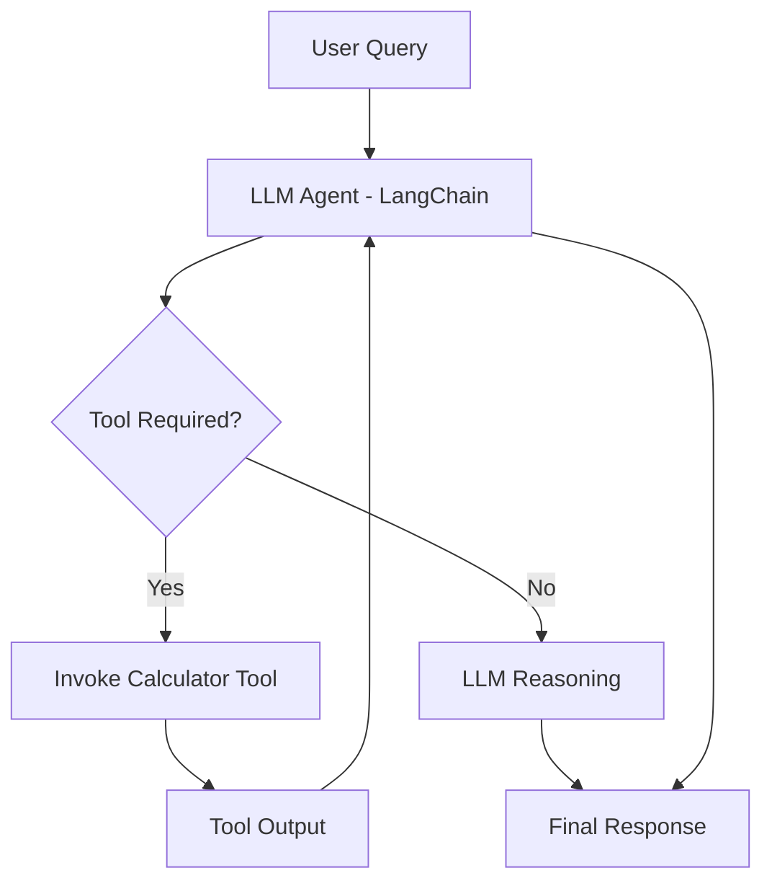

# AI-Agent


A foundational AI agent implementation using the **LangChain** framework with the **Groq API** (leveraging the `llama-3.3-70b-versatile` model).  
This project demonstrates how to build an intelligent agent that can reason, decide between tools, and leverage both custom tool logic and general LLM knowledge in responses.

---

## Overview

This repository showcases a simple autonomous AI agent that:

- Incorporates a **tool-use design pattern**
- Uses a custom **calculator tool** for numerical tasks
- Utilizes **LLM reasoning** for general conversational queries
- Integrates with the **Groq API** backend (LLM hosting)

The agent decides when to call the custom tool or rely on its internal reasoning to generate accurate responses.

---

## Features

- **LangChain-based architectural setup**
- **Tool selection logic** for improved accuracy
- Demonstrates how to combine **LLM reasoning** with specialized tools
- Ready to be extended with more tools and capabilities

---

## Tech Stack

- Python
- LangChain
- Groq API
- Custom tools (calculator)

---

## Getting Started

### 1. Clone the repository

```bash
git clone https://github.com/Arghya-Tech99/AI-Agent.git
cd AI-Agent
```
### 2. Create and activate a virtual environment

```bash
python -m venv .venv
.venv\Scripts\activate  # Windows
```

### 3. Install Dependencies
```bash
pip install -r requirements.txt
```

### 4. Configure environment variables
Rename the example environment file and add your API credentials:
```bash
cp .env.example .env
```
Then, edit the ```.env``` file and add your Groq API key:
```env
GROQ_API_KEY=your_api_key_here
```

### 5. Run the AI Agent
```bash
python main.py
```

---

## Example Usage

The AI agent supports both reasoning-based responses and tool-assisted computation.  It dynamically decides whether to invoke a custom tool or rely on large language model reasoning. Some example queries are given below:

- **Numerical computation**: Add 23 and 39
- **Percentage calculation**: What is 12% of 150?
- **Conceptual reasoning**: Explain the difference between supervised and unsupervised learning

---

## Flow Diagram: AI Agent Workflow

The following diagram illustrates the **end-to-end flow of control and data** in the AI agent, showing how user input is processed, how decisions are made, and when tools are invoked.


---

## Ideas for future extension

- Adding new tools (e.g., web search, file reader, calendar tools)
- Enhancing agent decision logic with improved prompt engineering
- Introducing memory or conversational state tracking
- Deploying the agent as a local service or API endpoint
